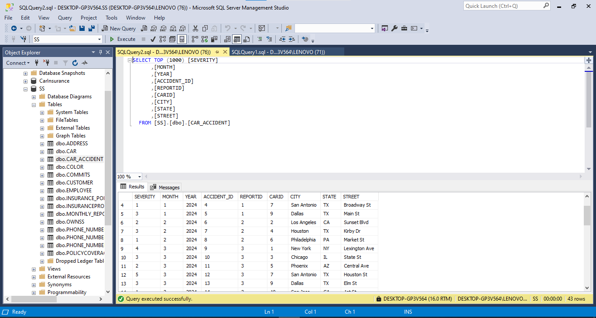
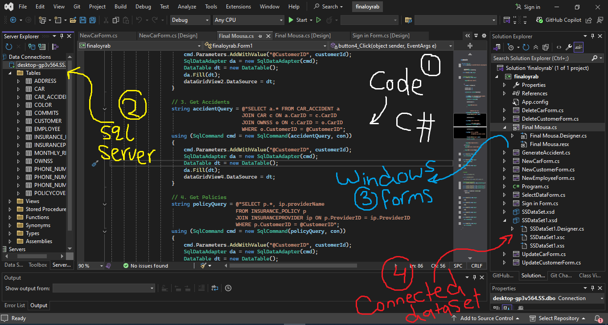

# Bastet Car Insurance System

Bastet Car Insurance System is a Windows Forms desktop application for managing a SQL Server car insurance database. It provides a simple staff login, customer search dashboard, and forms for creating, updating, deleting, and browsing insurance data.

## Features

- Employee sign-in flow with demo password protection
- Customer search dashboard with linked cars, policies, and accident history
- Customer, car, and employee management forms
- Accident report view
- Table browser for direct data inspection
- Shared SQL Server data layer for cleaner maintenance

## Tech Stack

- C#
- .NET Framework 4.7.2
- Windows Forms
- Microsoft SQL Server

## Project Structure

```text
bastet-car-insurance-system/
|-- README.md
|-- .gitignore
|-- database/
|   `-- create-ss-database.sql
|-- docs/
|   `-- screenshots/
|       |-- dashboard.png
|       `-- login.png
`-- src/
    |-- BastetCarInsuranceSystem.sln
    `-- BastetCarInsuranceSystem/
        |-- BastetCarInsuranceSystem.csproj
        |-- MainDashboardForm.cs
        |-- SignInForm.cs
        |-- CreateCustomerForm.cs
        |-- UpdateCustomerForm.cs
        |-- DeleteCustomerForm.cs
        |-- CreateCarForm.cs
        |-- UpdateCarForm.cs
        |-- DeleteCarForm.cs
        |-- CreateEmployeeForm.cs
        |-- AccidentReportForm.cs
        |-- DataBrowserForm.cs
        `-- Data/
            `-- Database.cs
```

## Screenshots

### Login



### Dashboard



## Database Setup

1. Open SQL Server Management Studio.
2. Run [`database/create-ss-database.sql`](database/create-ss-database.sql).
3. Make sure the database is available as `SS`.

The application currently uses a local SQL Server connection in [`App.config`](src/BastetCarInsuranceSystem/App.config):

```xml
Data Source=.;Initial Catalog=SS;Integrated Security=True;TrustServerCertificate=True
```

If your SQL Server instance is different, update that connection string before running the app.

## Run The App

1. Open [`src/BastetCarInsuranceSystem.sln`](src/BastetCarInsuranceSystem.sln) in Visual Studio.
2. Restore/build the solution.
3. Start the `BastetCarInsuranceSystem` project.

## Demo Login

- Employee ID: any valid `EMPLOYEEID` already present in the `EMPLOYEE` table
- Password: `team2025`

For a public release, change the demo password and replace the current login approach with a real authentication flow.

## Notes

- This repository keeps the final cleaned application only, not the older scratch folders.
- The SQL script included here creates the database schema. If you want demo records, you should add your own seed script or export sample data from your existing database.
